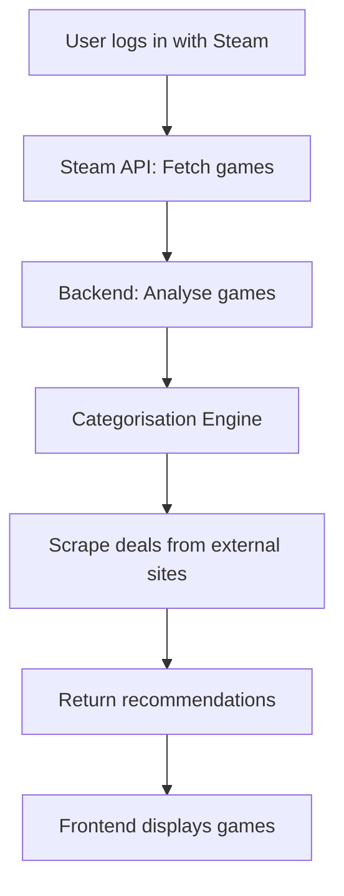

# 🎮 Game Recommender Platform — Technical Documentation

## 1. Overview

The **Game Recommender Platform** is a web application that analyses a user's Steam profile, identifies gaming patterns, and suggests similar games available for purchase on external sites (e.g., CDKeys, GreenManGaming). Additionally, it recommends games the user already owns but has not explored thoroughly.

---

## 2. System Architecture

### 2.1 High-Level Architecture Diagram

```
+-------------------+
|   Frontend (Web)  |
|-------------------|
| React / HTML/CSS  |
| JavaScript (TS)   |
| REST API Calls    |
+---------+---------+
          |
          v
+-------------------+
|  Backend (Python) |
|-------------------|
| FastAPI Framework |
| Steam API         |
| Scraper Modules   |
| Game DB/ML Model  |
+---------+---------+
          |
          v
+-------------------+
|    Data Sources   |
|-------------------|
| Steam API         |
| External Sellers  |
| DB (PostgreSQL)   |
+-------------------+
```

---

## 3. Key Features & Components

### 3.1 Steam Profile Analysis Module

* **Objective**: Fetch and analyse a user's Steam profile to categorise games.
* **Technologies**:

  * `Steam Web API` integration (via `requests` or `aiohttp` in Python)
  * User authentication via Steam OpenID (optional)
* **Features**:

  * Fetch owned games, playtime, genres.
  * Categorise based on play frequency, genres, multiplayer preferences.

---

### 3.2 Game Categorisation Engine

* **Objective**: Classify games by genre, mechanics, and engagement level.
* **Approach**:

  * Genre tagging via Steam metadata.
  * ML model (optional) for deeper insights, e.g., collaborative filtering.
* **Technologies**:

  * Scikit-learn for basic clustering (optional)
  * Manual tagging as fallback.

---

### 3.3 Web Scraper Module

* **Objective**: Fetch game deals from external sites.
* **Targets**:

  * CDKeys, GreenManGaming, Fanatical.
* **Implementation**:

  * `Scrapy` or `BeautifulSoup` for static content.
  * Selenium for dynamic sites (if necessary).
  * Rate limiting and retries for stability.

---

### 3.4 Recommendation Engine

* **Owned Games**:

  * Suggest underplayed games based on genre matching and user patterns.
* **New Games**:

  * Recommend similar games from external sellers based on categorisation.

---

### 3.5 Web Application (Frontend)

* **Stack**:

  * React.js or Next.js for UI.
  * TailwindCSS for styling.
  * API integration with Python backend (via REST).
* **Features**:

  * User login and profile view.
  * Recommendations dashboard.
  * Game deal listings.

---

### 3.6 Backend API

* **Framework**: FastAPI (for async capabilities & OpenAPI schema generation).
* **Endpoints**:

  * `/user/{steam_id}/profile`: Fetch and analyse Steam profile.
  * `/user/{steam_id}/recommendations`: Return personalised game suggestions.
  * `/deals/{game}`: Fetch deals for a specific game.
* **Security**: API key or token-based auth for external API usage.

---

### 3.7 Data Storage

* **Database**: PostgreSQL (structured data)
* **Tables**:

  * `users`: User profiles.
  * `games`: Game metadata (name, genre, developer, tags).
  * `recommendations`: Stored suggestions for each user.
  * `deals`: Scraped deal data (price, URL, source).

---

## 4. Data Flow



---

## 5. Non-Functional Requirements

| Requirement    | Description                                          |
| -------------- | ---------------------------------------------------- |
| Scalability    | Designed for concurrent users (asynchronous backend) |
| Data Freshness | Scraped data updated every 24 hours (cron/scheduler) |
| Caching        | Cache Steam profile data for 1 hour                  |
| Rate Limiting  | Implemented for external API calls                   |
| Security       | User data stored securely (hashed identifiers)       |

---

## 6. Tech Stack Summary

| Component     | Technology                                       |
| ------------- | ------------------------------------------------ |
| Backend       | Python (FastAPI, SQLAlchemy, Scrapy/BS4)         |
| Frontend      | React.js / Next.js + TailwindCSS                 |
| Database      | PostgreSQL                                       |
| External APIs | Steam Web API, CDKeys, GreenManGaming, Fanatical |
| ML (Optional) | scikit-learn, pandas                             |
| Deployment    | Docker, Nginx, Gunicorn/Uvicorn                  |

---

## 7. Next Steps

1. Set up FastAPI skeleton with REST endpoints.
2. Integrate Steam API and user authentication.
3. Develop basic frontend for user interaction.
4. Implement scraper module with static test cases.
5. Begin integration of ML-based or heuristic recommendation engine.

---

## 8. Acronyms & Terms Table

| Acronym / Term     | Meaning                                                       |
| ------------------ | ------------------------------------------------------------- |
| API                | Application Programming Interface                             |
| ML                 | Machine Learning                                              |
| REST               | Representational State Transfer (web service architecture)    |
| FastAPI            | A modern, fast Python web framework for building APIs         |
| Steam Web API      | Valve's API for Steam profile and game data                   |
| Scrapy             | A Python framework for web scraping                           |
| Selenium           | A tool for automating browsers (useful for scraping JS sites) |
| React.js / Next.js | JavaScript frameworks for building frontend web applications  |
| PostgreSQL         | A powerful, open-source relational database system            |
